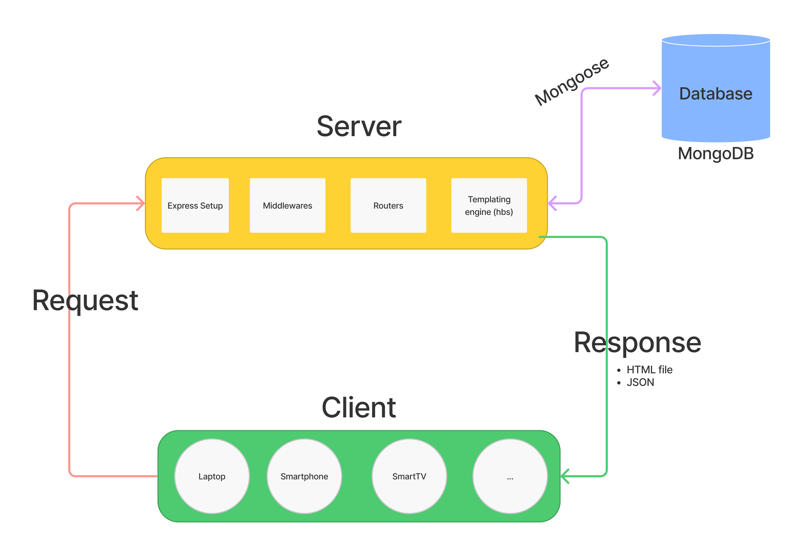

# Welcome to module 2

## What we will be seeing:

- Request / Response life cycles
- Server (Express Framework)
- Databases (MongoDB)
- ODM (Object Data Modeling) Mongoose
- API's => punkAPI (beers), pokeAPI...
- AJAX (Axios)

### Request / Response life cycle

### What we will be doing:

- Wax-on, Wax-off (Mainly)
- CRUD
