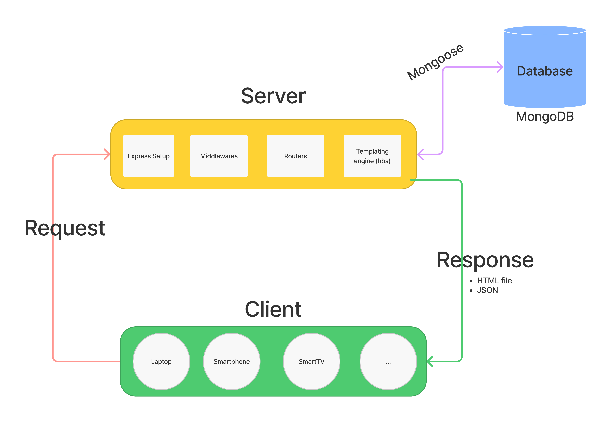
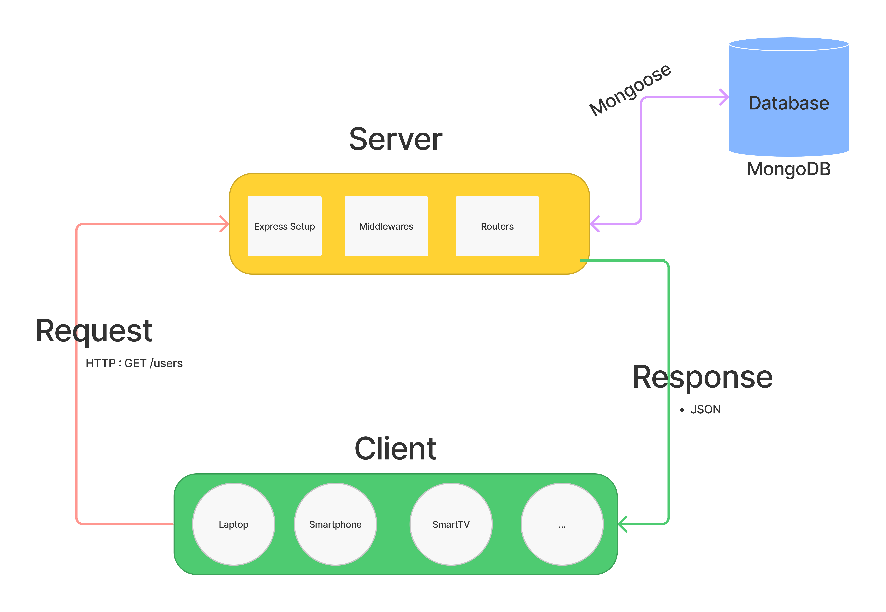
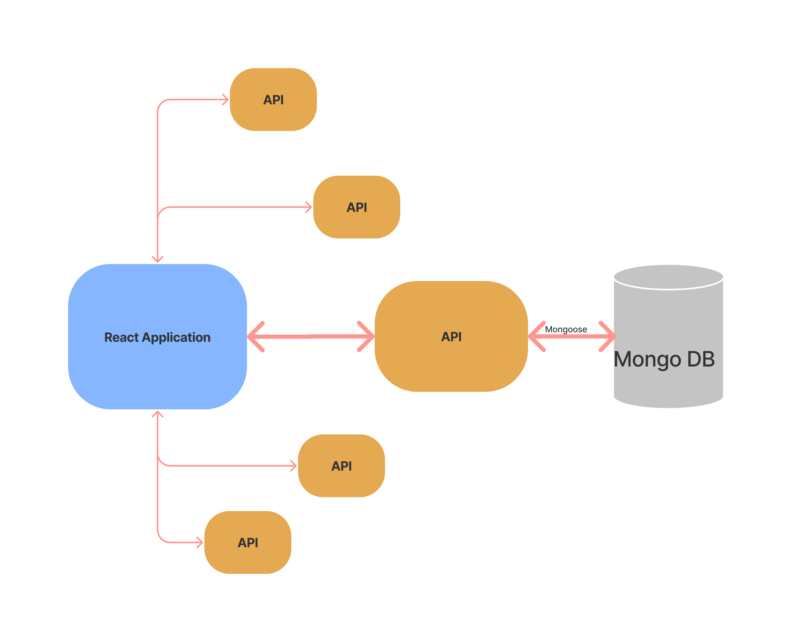

# End of module 2

## What we have seen:

- Request / Response life cycles
- Server (Express Framework)
- Databases (MongoDB)
- ODM (Object Data Modeling) Mongoose
- API's => punkAPI (beers), pokeAPI...
- AJAX (Axios)

### Request / Response life cycle

## What we will be doing:

- Sending JSON to the Browser and let him handle the whole display (treating information and displaying it)

## Api all around our application:

## Quick intro to React:

- We never interact with the DOM
- Imperative vs Declarative
- Statement and Expressions

## Necessary tools for React:

- CRA (using `npx`)
- VSCode extensions:
  - es7 React/Redux... Snippets
- React Developer Tools

## Let's now make a tour of CRA and see how to use expressions in JSX

## Components 🧁

